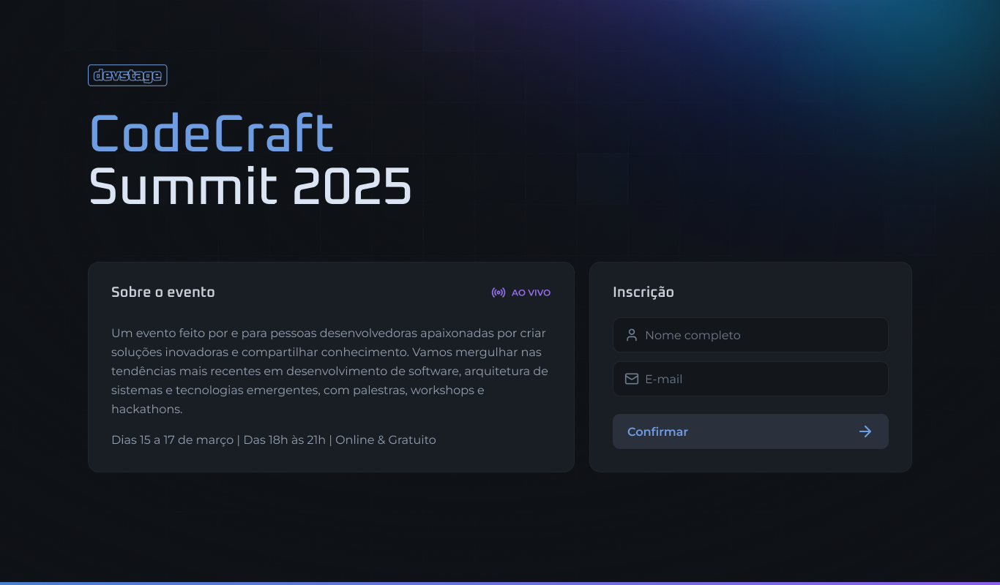
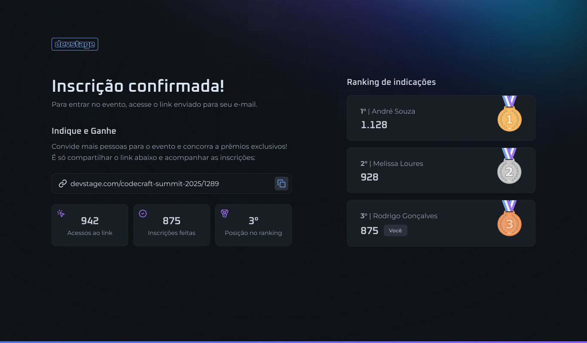

# DevStage 🚀

DevStage é uma aplicação desenvolvida em Next.js que simula a inscrição para um evento. A aplicação permite que os participantes gerem um link de compartilhamento, pelo qual é possível monitorar:

- 👁️ O número de acessos ao link.
- ✅ O número de inscrições feitas a partir do link.
- 🏆 A posição no ranking de indicações.

## Imagens da Aplicação 🖼️






## Tecnologias Utilizadas 🛠️

A aplicação foi desenvolvida utilizando as seguintes tecnologias e conceitos:

- **Next.js**: Framework para aplicações React, permitindo renderização híbrida (SSR/SSG).
- **React**: Biblioteca para criação de interfaces de usuário baseadas em componentes.
- **Tailwind CSS**: Framework de estilização para um design rápido e responsivo.
- **App Router**: Gerenciamento de rotas utilizando a nova abordagem do Next.js.
- **Server Components & Client Components**: Otimização da renderização e interatividade.
- **React Hook Form**: Gerenciamento de formulários de maneira eficiente e performática.
- **Orval**: Geração de cliente HTTP a partir de OpenAPI.
- **Biome**: Configuração e linting do código.
- **Zod**: Validação de dados e tipagem.
- **TypeScript**: Tipagem estática para maior segurança no desenvolvimento.

## Como Executar o Projeto ⚙️

### 1. Clonar o Repositório 💾

```sh
git clone https://github.com/seu-usuario/devstage.git
cd devstage
```

### 2. Instalar Dependências 📦

```sh
yarn install
# ou npm install
```

### 3. Configurar Variáveis de Ambiente 🔑

Crie um arquivo `.env.local` na raiz do projeto e configure as variáveis necessárias, como URL da API e chaves de acesso.

### 4. Rodar o Servidor de Desenvolvimento 🚀

```sh
yarn dev
# ou npm run dev
```

O servidor será iniciado em `http://localhost:3000`.

## Repositório da API 🔗

Para acessar o código da API utilizada neste projeto, clique [aqui](https://github.com/carlosEduardo-hub/DevStage_Backend).
